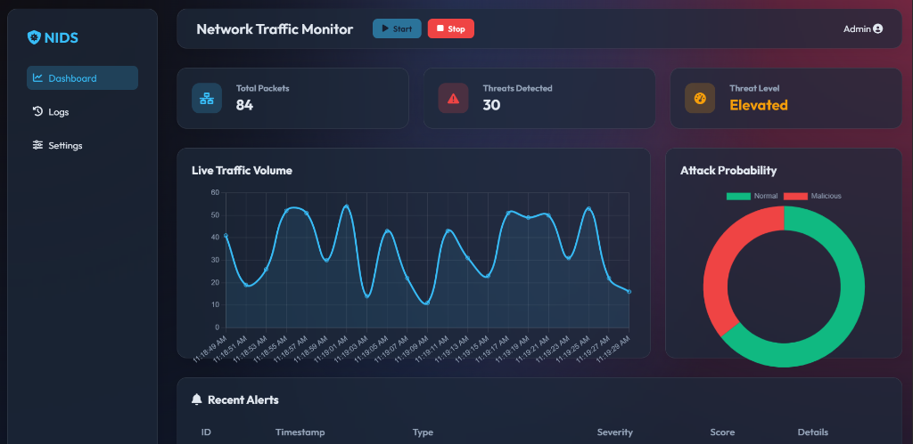

# AI-Driven Network Intrusion Detection System (NIDS)

An advanced machine learning-based intrusion detection pipeline and web dashboard designed to simulate and classify network traffic anomalies. This project leverages the **NSL-KDD** dataset to train a **Random Forest** classifier capable of distinguishing between normal traffic and malicious attack vectors (DoS, Probe, U2R, R2L) with **78.26% accuracy**. It features a real-time **Flask-based Dashboard** for visualizing threat levels and alerts.

## Table of Contents
- [Project Overview](#project-overview)
- [Key Features](#key-features)
- [Results & Performance](#results--performance)
- [Installation](#installation)
- [Usage](#usage)
- [Project Structure](#project-structure)
- [Future Roadmap](#future-roadmap)

## Project Overview

Traditional firewall systems often rely on static signature matching, making them vulnerable to zero-day attacks and novel intrusion patterns. This project implements a **statistical learning approach** to security, using supervised machine learning to identify malicious packet flows based on traffic characteristics rather than explicit signatures.

### Key Objectives
* **Data Ingestion:** Process raw network traffic records from the NSL-KDD dataset.
* **Feature Engineering:** Transform categorical packet headers (Protocol, Service, Flags) into numerical vectors.
* **Classification:** Train a Random Forest model to predict traffic labels (`normal` vs. `anomaly`).
* **Analysis:** Evaluate model performance on a distinct test set to simulate real-world generalization.

## Key Features

- **Real-time Dashboard**: A web interface tailored for security analysts to monitor traffic stats, threat levels, and live alerts.
  
  

- **Traffic Simulation**: Integrated engine that simulates network traffic patterns using real test data to demonstrate detection capabilities.

   

- **Robust Preprocessing**: Automatic handling of categorical features (`protocol_type`, `service`, `flag`) using label encoding.
- **Model Explainability**: Feature importance analysis identifies the specific network characteristics (e.g., `src_bytes`, `flag`) that trigger security alerts.
- **Zero-Day Simulation**: Tested on a specific test set (`KDDTest+`) that contains attack types **not present** in the training data, validating the model's ability to generalize.

## Results & Performance

| Metric | Value | Description |
| :--- | :--- | :--- |
| **Model** | Random Forest | Ensemble method with 50 estimators |
| **Training Set** | 125,973 records | KDDTrain+ |
| **Test Set** | 22,544 records | KDDTest+ (Novel attacks included) |
| **Accuracy** | **78.26%** | Realistic performance on unseen data |

> [!NOTE]
> The gap between training accuracy (>99%) and test accuracy (~78%) highlights the realistic challenge of **Zero-Day Attack Detection**. The model successfully generalizes to most attack categories but identifies specific novel attack signatures that would require iterative retraining in a production environment.

### Top Predictive Indicators
Analysis of Gini Importance identifies these features as the strongest indicators of malicious activity:
1.  **`src_bytes`**: Volume of data sent from source (high volume often indicates exfiltration or DoS).
2.  **`dst_bytes`**: Volume of data received at destination.
3.  **`flag`**: Connection status (e.g., `SF`, `S0` - indicating incomplete handshakes).

## Installation

### Prerequisites
* Python 3.8+
* pip

### Setup Guide

1. **Clone the Repository**
   ```bash
   git clone https://github.com/pjknsiah/NIDS.git
   cd NIDS
   ```

2. **Create a Virtual Environment (Optional but Recommended)**
   ```bash
   # Windows
   python -m venv venv
   venv\Scripts\activate

   # Linux/Mac
   python3 -m venv venv
   source venv/bin/activate
   ```

3. **Install Dependencies**
   ```bash
   pip install -r requirements.txt
   ```

4. **Download Dataset**
   The dataset is too large to include in the repo.
   - Download **[KDDTrain+.txt](https://raw.githubusercontent.com/defcom17/NSL_KDD/master/KDDTrain%2B.txt)**
   - Download **[KDDTest+.txt](https://raw.githubusercontent.com/defcom17/NSL_KDD/master/KDDTest%2B.txt)**
   - Place both files in the root directory of the project.

## Usage

You can run the project in two modes: **CLI Training** or **Web Dashboard**.

### 1. Launch the Web Dashboard (Recommended)
Start the Flask application to view the simulation and alerts in your browser.
```bash
python app.py
```
*   Access the dashboard at: `http://localhost:5000`
*   The dashboard will automatically load the model and start simulating traffic.

### 2. Run CLI Training & Evaluation
To retrain the model and see raw performance metrics in the terminal:
```bash
python nids.py
```

## Project Structure

```text
nids-project/
├── app.py              # Flask Web Application & Simulation Engine
├── templates/          # HTML Templates for the Dashboard
├── static/             # CSS/JS Assets
├── nids.py             # ML Core (Load -> Preprocess -> Train -> Evaluate)
├── KDDTrain+.txt       # Training dataset
├── KDDTest+.txt        # Testing dataset
├── README.md           # Documentation
└── requirements.txt    # Python dependencies
```

## Future Roadmap
- [ ] Implement Deep Learning models (LSTM/CNN) for sequential pattern recognition.
- [ ] Add real-time packet capture using `scapy` for live intrusion detection.

---
*Built for the purpose of Network Security Research.*
